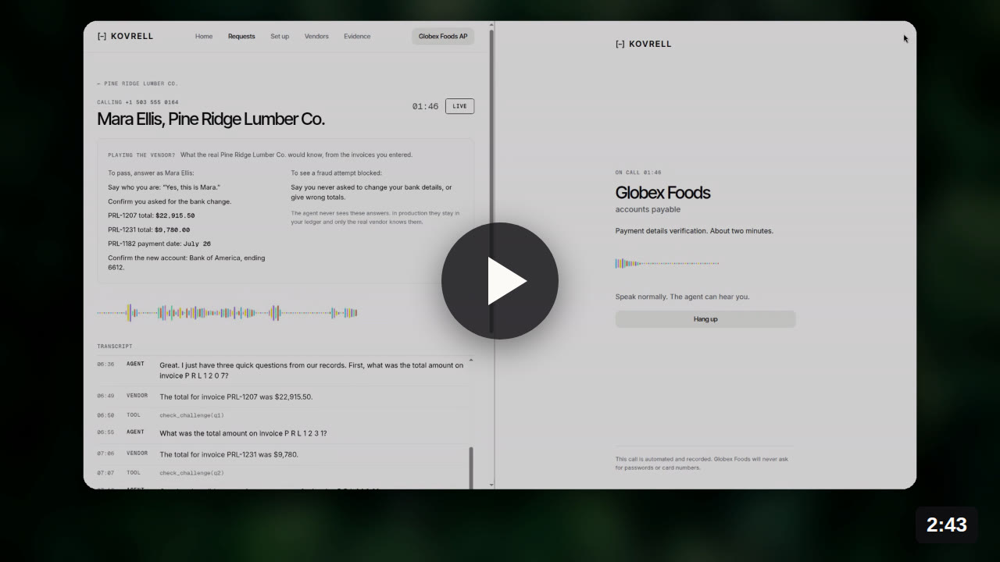
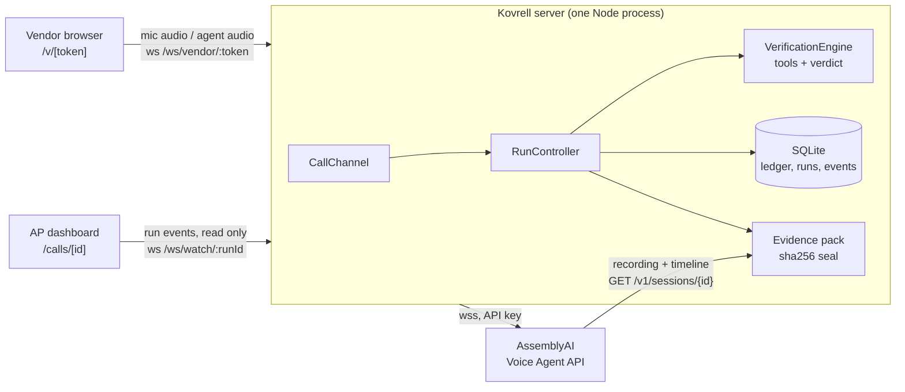
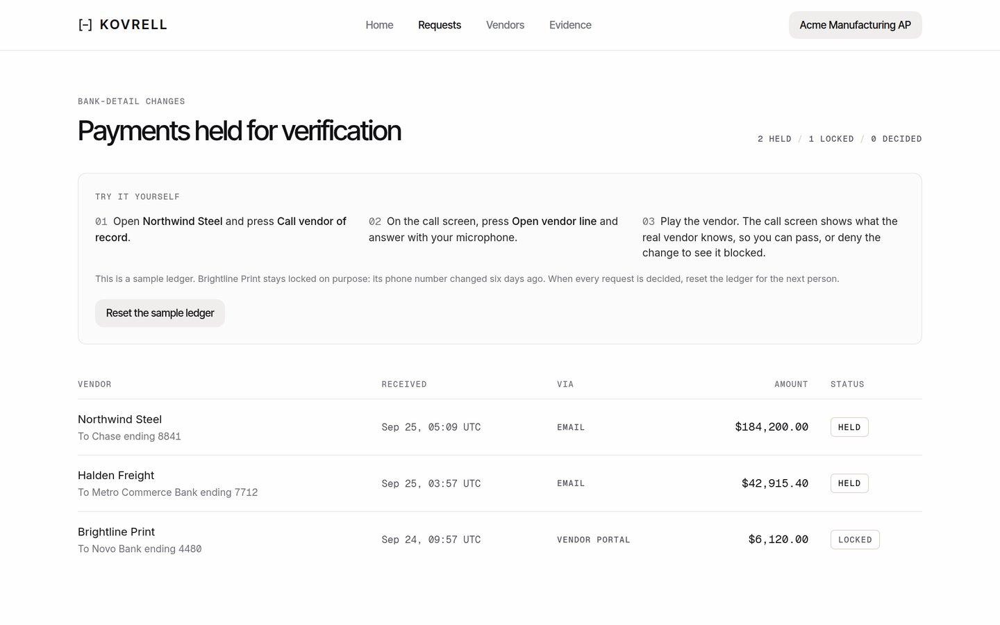
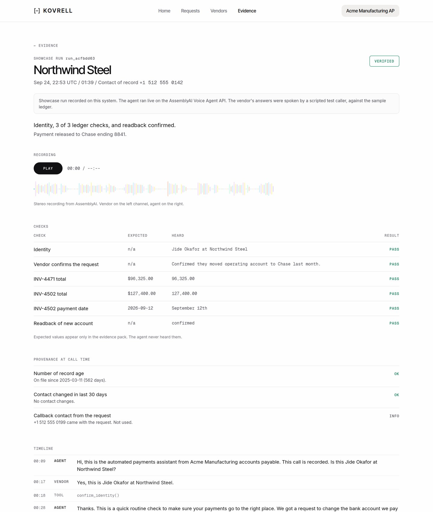

# Kovrell

A voice agent that calls the vendor back before a changed bank account gets paid. Built on the [AssemblyAI Voice Agent API](https://www.assemblyai.com/docs/voice-agents/voice-agent-api).

**Live app:** https://kovrell.midelabs.xyz · **Demo video:** [2:43 on YouTube](https://youtu.be/nUYKtbkv1CY) · **Recorded call:** [/evidence/run_acfbdd63](https://kovrell.midelabs.xyz/evidence/run_acfbdd63) · **API:** [/integrate](https://kovrell.midelabs.xyz/integrate)

[](https://youtu.be/nUYKtbkv1CY)

## The problem

Vendor bank-detail fraud starts with one email: "We changed banks, please pay the new account." Accounts payable is supposed to call the vendor back on the number on file before paying. Most teams have that rule, and it still fails.

- 74% of US organizations were hit by business email compromise in 2025, mostly vendor or executive impersonation ([AFP 2026, p. 6](https://www.truist.com/content/dam/truist-bank/us/en/documents/info/cci/2026-afp-payments-fraud-control-survey-report-key-highlights.pdf#page=6)).
- 94% call back on a number from official records, but only 63% rate that control as very effective ([AFP 2026, p. 15](https://www.truist.com/content/dam/truist-bank/us/en/documents/info/cci/2026-afp-payments-fraud-control-survey-report-key-highlights.pdf#page=15)).
- Only 17% use AI against payments fraud ([AFP 2026 press release](https://www.financialprofessionals.org/about/learn-more/press-releases/Details/over-75-percent-of-us-firms-experienced-payments-fraud-in-2025-while-ai-adoption-for-fraud-mitigation-lags)).

Manual callbacks get skipped under deadline pressure, get placed to the number in the fraudulent email, and accept "yes, that's us" as proof. They leave nothing for the auditor.

## The solution

Kovrell holds the payment and makes the callback itself. The agent calls only the contact of record, asks questions only the real vendor can answer from your own ledger, and never learns the answers. Server code compares what it heard against the ledger and decides the verdict. Every call is sealed into an evidence pack with the AssemblyAI recording and a sha256 hash.

1. A bank-change request arrives and the payment is held.
2. A preflight checks the number of record. If it changed in the last 30 days, the call is locked. Someone on the AP team confirms the change in person, on video, or on a number they already trust, and records it in Kovrell. That record is sealed like any call, and it's also how a call that ended without a verdict gets closed. A FAIL can't be overridden.
3. The agent calls the vendor: confirm identity, confirm they made the request, answer three ledger questions, and confirm a readback of the new account. The questions (two invoice totals and one payment date) are drawn at random from the vendor's recent paid invoices on every call, so there's no fixed script to prepare for.
4. The server scores the answers, applies the verdict, and seals the evidence.

| Verdict | Rule | Payment |
|---|---|---|
| PASS | Identity and request confirmed, at least 2 of 3 ledger answers right, readback confirmed | Released to the new account |
| FAIL | Request denied, wrong person, 2 or more wrong answers, or readback rejected | Blocked, account on file kept |
| INCONCLUSIVE | Hangup, timeout, provider error, or missing steps | Stays held, retry allowed |
| LOCKED | Number of record changed in the last 30 days | No call placed. A person can confirm in person and record it |

"I don't know" counts as wrong, and each question gets one attempt. Vendors can read what's recorded and kept on [/privacy](https://kovrell.midelabs.xyz/privacy). Resetting the sandbox deletes Kovrell's records and the AssemblyAI recordings of those calls.

## How it uses AssemblyAI

Kovrell runs on the Voice Agent API end to end: speech-to-text, the LLM turn, voice output, turn-taking, and tool calls over one WebSocket.

| Feature | Use in Kovrell |
|---|---|
| `session.update` per run | The prompt, greeting, and tools are built per request from the ledger ([config.ts](src/server/agent/config.ts)). The prompt carries the questions, never the answers. |
| JSON-Schema tool calling | Five tools: `confirm_identity`, `record_request_status`, `check_challenge`, `confirm_readback`, `finish_verification`. `question_id` is a per-run enum, so the model can't invent questions. |
| `execution_mode: "hold"` | `finish_verification` keeps the agent silent until the server returns a neutral closing line, so the verdict is never spoken on the call. |
| `transcription_mode: "max_accuracy"` + `keyterms` | Dollar amounts and dates need accuracy. Vendor, contact, bank, and invoice names are passed as keyterms. |
| Barge-in | `reply.done` with `status: interrupted` flushes queued agent audio. |
| Session artifacts | After `session.ended`, the server fetches the stereo recording and timeline from `GET /v1/sessions/{id}` and seals them into the evidence pack ([evidence.ts](src/server/evidence.ts)). |

## Architecture



The server holds the AssemblyAI socket, and the vendor's browser is only an audio pipe. The person on the call may be the fraudster, so if their browser held the socket it could rewrite the prompt with its own `session.update` or fake a tool result. The browser never gets a token, a transcript, or a tool result.

| Component | Role |
|---|---|
| [`server.ts`](server.ts), [`ws-routes.ts`](src/server/ws-routes.ts) | One process serves Next.js and the WebSocket endpoints |
| [`channels.ts`](src/server/channels.ts) | `CallChannel` interface. The browser channel is built, and a Twilio phone channel plugs in behind the same interface |
| [`runs.ts`](src/server/runs.ts) | Run lifecycle: preflight, call link, session, verdict, payment status |
| [`agent/`](src/server/agent) | AssemblyAI session config and the event loop for audio, tools, and barge-in |
| [`verification/`](src/server/verification) | Provenance preflight, ledger questions, answer parsing, and the deterministic verdict |
| [`evidence.ts`](src/server/evidence.ts) | Fetches session artifacts and seals the evidence pack |

Any failure (socket error, provider error, 6-minute timeout, early hangup, missing artifacts) fails closed to INCONCLUSIVE, and the payment stays held. Full design notes are in [ARCHITECTURE.md](docs/ARCHITECTURE.md).

## What makes it different

Most voice agent demos let the LLM decide the outcome. In Kovrell the model asks the questions and code decides. The agent never sees the answers, can't say whether one was right, and can't pick the verdict.

| Alternative | Gap Kovrell closes |
|---|---|
| Manual callback by AP staff | Skipped under pressure, depends on who picks up, leaves no record |
| Bank-account validation services | Confirms the account exists, not that the vendor asked for the change |
| Email security and BEC filters | Acts on the email. Kovrell acts at the point of payment, whatever channel the request came from |

Every behavior below has a test:

| Scenario | Result | Test |
|---|---|---|
| Fraudster confirms the request but guesses the answers | FAIL, payment blocked | [verification.test.ts#L165](src/server/verification/verification.test.ts#L165) |
| Real vendor never requested a change | FAIL, account on file kept | [runs.test.ts#L120](src/server/runs.test.ts#L120) |
| Phone number of record changed first | LOCKED before any call | [runs.test.ts#L88](src/server/runs.test.ts#L88) |
| "Hello, can you hear me?" taken as identity | Needs explicit confirmation from the caller | [agent-session.test.ts#L93](src/server/agent/agent-session.test.ts#L93) |
| Call drops after good answers | INCONCLUSIVE, payment held | [agent-session.test.ts#L113](src/server/agent/agent-session.test.ts#L113) |
| AssemblyAI session fails | Fails closed to INCONCLUSIVE | [agent-session.test.ts#L175](src/server/agent/agent-session.test.ts#L175) |
| Answers leak into the prompt, the API, or the vendor page | Config, API views, and vendor socket carry no answers | [agent-session.test.ts#L52](src/server/agent/agent-session.test.ts#L52), [views.test.ts#L9](src/server/views.test.ts#L9) |
| Webhook URL aimed at an internal address (SSRF) | Refused at registration and again before every delivery | [webhook.test.ts#L31](src/server/webhook.test.ts#L31), [webhook.test.ts#L62](src/server/webhook.test.ts#L62) |

## Try it

The live app runs on a sample ledger with three vendors. You play the vendor with your microphone.

1. Open [/requests](https://kovrell.midelabs.xyz/requests). Brightline Print is locked because its number changed six days ago.
2. Open Northwind Steel ($184,200.00), press **Call vendor of record**, then **Open vendor line**.
3. The call screen shows a tester sheet with what the real vendor knows. Answer from it to get PASS, or deny the request or guess the totals to get FAIL. The sheet exists only so you can play the vendor in this demo. It never reaches the vendor page or the API.
4. Open [/evidence](https://kovrell.midelabs.xyz/evidence) for the sealed record: checks, recording, timeline, and the sha256 seal with a command to re-verify it.
5. Download the PDF report from the evidence page. That's what an auditor would file.
6. Press **Reset the sample ledger** on /requests when you're done.

**Try it on your own vendor:** open [/setup](https://kovrell.midelabs.xyz/setup), enter your company name, a made-up vendor, its contact, a few paid invoices, and the bank change. Paste a [webhook.site](https://webhook.site) URL to watch the signed verdict arrive when the call ends. Kovrell holds the payment, and you take the call as that vendor with questions drawn from the invoices you entered. Pick "Changed 6 days ago" for the phone to see the call refused. This is the same data an ERP sends through `POST /api/vendors` and `POST /api/requests`.



No microphone? [run_acfbdd63](https://kovrell.midelabs.xyz/evidence/run_acfbdd63) is a recorded PASS call (about 100 s, 3 of 3 checks, 1.96 s median response time). The vendor side was spoken by a scripted test caller, and the page says so.



The same flow works over the API:

```bash
curl -X POST https://kovrell.midelabs.xyz/api/requests/req_halden/runs       # 201 with a vendor call link
curl -X POST https://kovrell.midelabs.xyz/api/requests/req_brightline/runs   # 423 locked by provenance
curl https://kovrell.midelabs.xyz/api/runs/<run id>                          # live checks and verdict
```

## Business value and next steps

Kovrell fits into any accounts payable flow as a hold step. The ERP syncs vendors and paid invoices through `POST /api/vendors` and sends each bank-change request to `POST /api/requests` with a `webhook_url`. The payment stays held until the call ends, then Kovrell posts a signed `verification.completed` webhook (HMAC-SHA256, the Stripe-style `t=,v1=` scheme) with the verdict and payment status. Every run has a JSON evidence record and a PDF report for the audit file.

Current scope:

- Sample ledger plus vendors you add on /setup. ERP and AP connectors come next, using `POST /api/vendors` and `POST /api/requests` as the entry points.
- Calls run in the browser. A phone channel (Twilio `audio/pcmu`, which AssemblyAI accepts natively) is designed behind the `CallChannel` interface.
- Ledger questions stop outsiders, not insiders with access to the vendor's invoices. Voice cloning isn't detected.
- Single instance with SQLite, so people testing at once share the same ledger. Starting calls is limited to 3 a minute per visitor.
- Hackathon code, not audited for real payments.

## Run locally

Requires Node 22 and an AssemblyAI API key.

```bash
git clone https://github.com/mystiquemide/kovrell && cd kovrell
npm install
cp .env.example .env.local   # set ASSEMBLYAI_API_KEY
npm test
npm run dev                  # http://localhost:3000
```

Stack: Next.js 16, React 19, TypeScript, Tailwind v4, `ws`, SQLite (`better-sqlite3`), Vitest. One Node process serves the app and the WebSockets.

## License

[MIT](LICENSE). Photos from Unsplash under the Unsplash License: forest in motion by Beau Carpenter, warm blur by Liana S.
